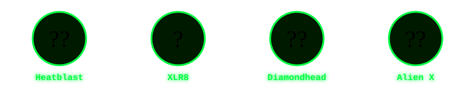

<!-- ═══════════════════════════════════════════════════════════════════ -->
<!--              🟢 OMNITRIX — ATHARV SHUKLA GITHUB PROFILE 🟢        -->
<!-- ═══════════════════════════════════════════════════════════════════ -->

<div align="center">

<!-- CINEMATIC DARK HEADER WAVE -->


<!-- BEN 10 OMNITRIX SPINNING SVG — GitHub-compatible animated SVG -->


<!-- TYPING ANIMATION — BEN 10 THEMED -->
<a href="https://github.com/atharvshukla76">
  
</a>

<br/>

<!-- BADGES — Live counter + self-hosted Focus badge -->
<a href="https://github.com/atharvshukla76">
  
</a>
&nbsp;
<a href="https://github.com/atharvshukla76?tab=followers">
  
</a>
&nbsp;
<a href="https://github.com/atharvshukla76?tab=repositories">
  
</a>

</div>

---

<!-- ═══════════════════════════════════════════════════════════════════ -->
<!--                    🟢 OMNITRIX BANNER                             -->
<!-- ═══════════════════════════════════════════════════════════════════ -->

<div align="center">

</div>

<div align="center">

<!-- BEN 10 ANIMATED BANNER — Omnitrix HUD style -->


</div>

---

## 🟢 About Me — Omnitrix Scanned

```python
class AtharvShukla:
    name        = "Atharv Shukla"
    alias       = "The Data Alien 👽"
    role        = ["Data Analyst", "ML Engineer", "Power BI Developer"]
    location    = "India 🇮🇳"
    linkedin    = "linkedin.com/in/atharv-shukla-8b4426298"
    languages   = ["Python", "SQL", "DAX", "M Language", "HTML", "CSS"]
    tools       = ["Power BI", "TensorFlow", "scikit-learn", "FastAPI", "Pandas", "NumPy"]
    currently   = "Building emotion detection systems & interactive dashboards"
    omnitrix    = "FULLY CHARGED 🟢"
    fun_fact    = "I turn messy data into cinematic stories 🎬📊"
    ben10_quote = "It's Hero Time! 🦸‍♂️"

    def transform(self, challenge):
        alien = self.omnitrix.scan(challenge)
        return f"Transformed into {alien} — Problem SOLVED! ✅"

me = AtharvShukla()
print(me.transform("complex data problem"))
# Output: Transformed into FourArms — Problem SOLVED! ✅
```

---

<!-- ═══════════════════════════════════════════════════════════════════ -->
<!--                🟢 BEN 10 ALIEN FORCE SECTION                      -->
<!-- ═══════════════════════════════════════════════════════════════════ -->

## 🛸 Alien Force — Tech Stack

<div align="center">


### 🌀 Heatblast — Languages (On Fire 🔥)


### 💧 Ripjaws — Data & BI (Deep Dive 📊)

&nbsp;

&nbsp;

&nbsp;

&nbsp;


### 🧠 Grey Matter — ML & AI (Big Brain 🤖)

&nbsp;

&nbsp;


### ⚡ XLR8 — Frameworks & Speed Tools


</div>

---

<!-- ═══════════════════════════════════════════════════════════════════ -->
<!--                     📊 GITHUB STATS                               -->
<!-- ═══════════════════════════════════════════════════════════════════ -->

## 📈 Omnitrix Stats — Power Level

<div align="center">


&nbsp;&nbsp;


<br/><br/>


</div>

---

<!-- ═══════════════════════════════════════════════════════════════════ -->
<!--                     🏆 TROPHIES                                   -->
<!-- ═══════════════════════════════════════════════════════════════════ -->

## 🏆 Hero Trophies

<div align="center">
  
</div>

---

<!-- ═══════════════════════════════════════════════════════════════════ -->
<!--                   🚀 FEATURED PROJECTS                            -->
<!-- ═══════════════════════════════════════════════════════════════════ -->

## 🚀 Mission Files — Featured Projects

<div align="center">

<table>
<tr>
<td width="50%" align="center">

### 📊 Madhav E-Commerce Dashboard
<a href="https://github.com/atharvshukla76/Madhav-E-Commerce-Sales-Dashboard">
  
</a>

**Power BI · DAX · CSV Data**  
Interactive e-commerce sales analysis with KPIs for 500+ orders across Indian states.

[](https://github.com/atharvshukla76/Madhav-E-Commerce-Sales-Dashboard)
[](https://github.com/atharvshukla76/Madhav-E-Commerce-Sales-Dashboard/raw/main/MADHAV%20ECOMMERCE%20SALES%20DASHBOARD.pbix)

</td>
<td width="50%" align="center">

### 🎭 Moodwave — Emotion Detection
<a href="https://github.com/atharvshukla76">
  
</a>

**TensorFlow · FastAPI · HTML/CSS**  
Real-time audio-based emotion detection with a cinematic web UI hosted on GitHub Pages.

[](https://atharvshukla76.github.io)
[](https://github.com/atharvshukla76)

</td>
</tr>
</table>

</div>

---

<!-- ═══════════════════════════════════════════════════════════════════ -->
<!--               🐍 CONTRIBUTION SNAKE ANIMATION                     -->
<!-- ═══════════════════════════════════════════════════════════════════ -->

## 🐍 Contribution Graph — Omnitrix Energy Trail

<div align="center">
  <picture>
    <source media="(prefers-color-scheme: dark)" srcset="https://raw.githubusercontent.com/atharvshukla76/atharvshukla76/output/github-contribution-grid-snake-dark.svg"/>
    <source media="(prefers-color-scheme: light)" srcset="https://raw.githubusercontent.com/atharvshukla76/atharvshukla76/output/github-contribution-grid-snake.svg"/>
    
  </picture>
</div>

---

<!-- ═══════════════════════════════════════════════════════════════════ -->
<!--                    📉 ACTIVITY GRAPH                               -->
<!-- ═══════════════════════════════════════════════════════════════════ -->

## 📉 Omnitrix Activity Graph

<div align="center">
  
</div>

---

<!-- ═══════════════════════════════════════════════════════════════════ -->
<!--                🟢 BEN 10 OMNITRIX SVG ANIMATION                   -->
<!-- ═══════════════════════════════════════════════════════════════════ -->

## 🟢 Omnitrix Status — Always Charged

<div align="center">

<!-- Omnitrix Glowing Badge -->

&nbsp;

&nbsp;


<br/><br/>

<!-- Animated SVG Omnitrix clock/dial -->
<svg width="200" height="200" viewBox="0 0 200 200" xmlns="http://www.w3.org/2000/svg">
  <defs>
    <radialGradient id="omniGlow" cx="50%" cy="50%" r="50%">
      <stop offset="0%" stop-color="#00ff41" stop-opacity="0.9"/>
      <stop offset="60%" stop-color="#003300" stop-opacity="0.7"/>
      <stop offset="100%" stop-color="#000000" stop-opacity="1"/>
    </radialGradient>
    <filter id="glow">
      <feGaussianBlur stdDeviation="4" result="coloredBlur"/>
      <feMerge>
        <feMergeNode in="coloredBlur"/>
        <feMergeNode in="SourceGraphic"/>
      </feMerge>
    </filter>
  </defs>
  <!-- Outer ring -->
  <circle cx="100" cy="100" r="95" fill="#000000" stroke="#00ff41" stroke-width="4" filter="url(#glow)">
    <animate attributeName="stroke-opacity" values="1;0.3;1" dur="2s" repeatCount="indefinite"/>
  </circle>
  <!-- Middle ring -->
  <circle cx="100" cy="100" r="75" fill="url(#omniGlow)" stroke="#00cc33" stroke-width="3">
    <animate attributeName="r" values="75;77;75" dur="1.5s" repeatCount="indefinite"/>
  </circle>
  <!-- Inner hourglass shape (Ben 10 symbol) -->
  <polygon points="100,30 140,100 100,170 60,100" fill="#000000" stroke="#00ff41" stroke-width="2" filter="url(#glow)">
    <animateTransform attributeName="transform" type="rotate" from="0 100 100" to="360 100 100" dur="8s" repeatCount="indefinite"/>
  </polygon>
  <!-- Center circle -->
  <circle cx="100" cy="100" r="18" fill="#00ff41" filter="url(#glow)">
    <animate attributeName="fill" values="#00ff41;#39ff14;#00cc33;#00ff41" dur="2s" repeatCount="indefinite"/>
    <animate attributeName="r" values="18;22;18" dur="1.5s" repeatCount="indefinite"/>
  </circle>
  <!-- Center dot -->
  <circle cx="100" cy="100" r="6" fill="#000000"/>
  <!-- Rotating tick marks -->
  <g>
    <line x1="100" y1="10" x2="100" y2="25" stroke="#00ff41" stroke-width="3">
      <animateTransform attributeName="transform" type="rotate" from="0 100 100" to="360 100 100" dur="3s" repeatCount="indefinite"/>
    </line>
  </g>
  <g>
    <line x1="100" y1="10" x2="100" y2="20" stroke="#00cc33" stroke-width="2" opacity="0.6">
      <animateTransform attributeName="transform" type="rotate" from="0 100 100" to="-360 100 100" dur="5s" repeatCount="indefinite"/>
    </line>
  </g>
</svg>

<br/>


</div>

---

<!-- ═══════════════════════════════════════════════════════════════════ -->
<!--                     🌐 CONNECT SECTION                            -->
<!-- ═══════════════════════════════════════════════════════════════════ -->

## 🌐 Signal Me — Connect

<div align="center">

<a href="https://github.com/atharvshukla76">
  
</a>
&nbsp;
<a href="https://www.linkedin.com/in/atharv-shukla-8b4426298">
  
</a>
&nbsp;
<a href="mailto:atharvshukla76@gmail.com">
  
</a>

<br/><br/>

> *"Omnitrix charged. Data loaded. It's Hero Time! 🟢"*

<br/>

<!-- Alien transformation quote cycling -->


</div>

<!-- ═══════════════════════════════════════════════════════════════════ -->
<!--                  🟢 CINEMATIC FOOTER WAVE                         -->
<!-- ═══════════════════════════════════════════════════════════════════ -->


